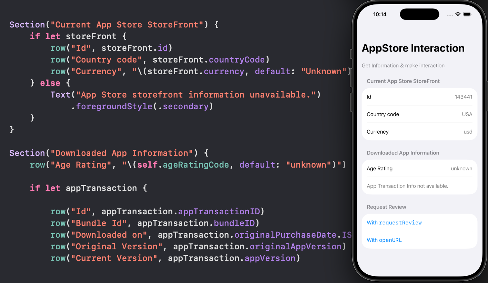

# SwiftUI_AppStoreInfoInteraction

A demo of getting App Store related information.

- Get current App Store storefront information (country, currency, and etc.) and watch for changes
- Get purchased (downloaded) app information
- Get Messages from App Store and control the display of those
- Request for review

For more details, please refer to my blog [Little SwiftUI Tip: Interact with App Store](https://medium.com/p/635e9d80ecf9)

